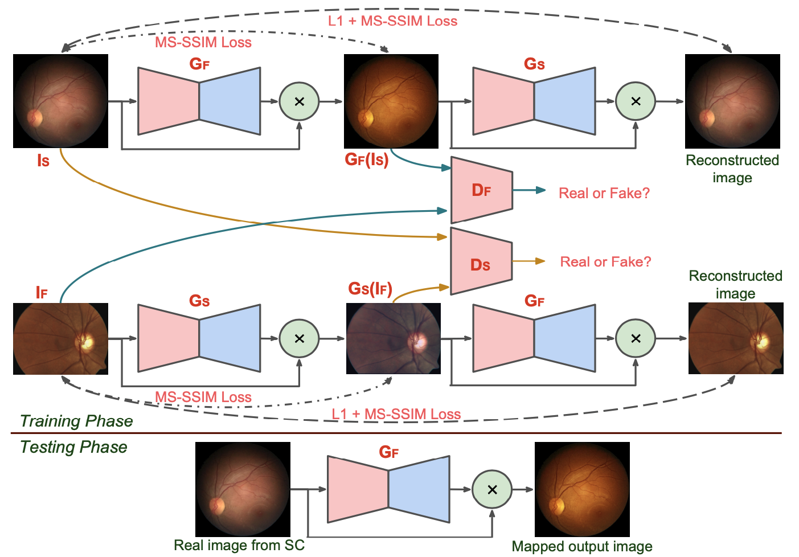

# ResCycleGAN - Matching the Characteristics of Fundus and Smartphone Camera Images

Fundus imaging with a Smartphone camera (SC) is a cost-effective solution for the assessment of retina. However, imaging at high magnification and low light levels, results in loss of details, uneven illumination and noise especially in the peripheral region. We address these problems by matching the characteristics of images from SC to those from a regular fundus camera (FC) with an architecture called **ResCycleGAN**. It is based on the CycleGAN with two significant changes: A residual connection is introduced to aid learning only the correction required; A structure similarity based loss function is used to improve the clarity of anatomical structures and pathologies. The proposed method can handle variations seen in normal and pathological images, acquired even without mydriasis, which is attractive in screening. The method produces consistently balanced results, outperforms CycleGAN both qualitatively and quantitatively, and has more pleasing results.

Download Paper: [[ResCycleGAN]](https://web2py.iiit.ac.in/research_centres/publications/download/inproceedings.pdf.b1aa1149db0fc5d4.53756b6573685f4953424931395f303330352e706466.pdf)

Overview of proposed ResCycleGAN architecture:



### Dependencies
This code depends on the following libraries:
- Keras >= 2.0
- keras_contrib >= 1.2.1
- Theano = 0.9.0

Code should be compatible with Python versions 2.7-3.5. (tested in python2.7)

### Datasets
Place the data in below path for mapping A<-->B 
- A dataset in ./datasets/A_to_B/trainA
- B dataset in ./datasets/A_to_B/trainB

### Training 
The model can be trained to reproduced with command:

```
python2.7 ResCycleGAN.py
```

### Test
- Place the test set for A to B mapping (A->B) in ./datasets/A_to_B/testA

- weights for ResCycleGAN is placed in ./weights for testing

To test:
```
python2.7 test_ResCycleGAN.py
```

Results will be stored inside ./images

### Citation
If you find this code useful for your research, please cite:

```
@inproceedings{adiga2019matching,
  title={Matching The Characteristics Of Fundus And Smartphone Camera Images},
  author={Adiga, V Sukesh and Sivaswamy, Jayanthi},
  booktitle={2019 IEEE 16th International Symposium on Biomedical Imaging (ISBI 2019)},
  pages={569--572},
  year={2019},
  organization={IEEE}
}
```

#### References
- Pytorch MS-SSIM [[code]](https://github.com/jorge-pessoa/pytorch-msssim)
- Pytorch CycleGAN [[code]](https://github.com/junyanz/pytorch-CycleGAN-and-pix2pix)
- GAN Zoo [[link1]](https://github.com/hindupuravinash/the-gan-zoo) [[link2]](https://github.com/znxlwm/pytorch-generative-model-collections)
- DSLR-Quality Photos on Mobile Devices DPED [[code]](https://github.com/aiff22/DPED#dslr-quality-photos-on-mobile-devices-with-deep-convolutional-networks)
- Image Denoising [[link]](https://github.com/wenbihan/reproducible-image-denoising-state-of-the-art)
- Unet Family [[link]] (https://github.com/ShawnBIT/UNet-family)

#### Any questions?
```
For more informations, please contact Sukesh Adiga (sukesh.adiga@gmail.com).
```

#### License
This project is licensed under the terms of the MIT license.
